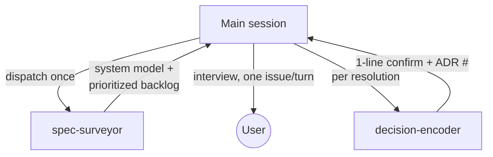

# Spec Sharpener

Turn a fuzzy early-stage specification into one that a competent engineer could
implement without having to guess. This is an **interview-and-edit** workflow,
not a report generator. The deliverables are (1) sharper documents and (2) a log
of the decisions that made them sharper.

## Architecture: keep the main session lean

The interview is the only part that *must* live in this (the main) session,
because it's the conversation with the user. The two expensive, context-heavy
parts are delegated to subagents so their bulk never sits in your context:

- **`spec-surveyor`** (read-only) does the discovery, model-building, and sweep,
  and hands back a compact, prioritized backlog — each finding already carrying
  its quoted anchor, the problem, why it matters, and concrete options. All the
  doc text and the taxonomy stay inside that subagent and are discarded.
- **`decision-encoder`** (write) takes one resolved finding plus the agreed
  resolution and does all the file work — edits the docs, writes the ADR, indexes
  it — returning a one-line confirmation. The template and the edited section body
  never enter your context.

So your job is: dispatch the surveyor once, hold the compact backlog, run the
interview loop, and dispatch the encoder once per resolution. You never load the
full corpus and never hold the ADR template.

## When this applies

The project is greenfield: docs/spec exist, but there is no real implementation
yet — at most boilerplate (a scaffolded repo, a `package.json`, an empty folder
structure). The goal is to make the *specification* implementation-ready. The
boilerplate is treated as a signal (what framework, what naming, what shape was
assumed), not as the thing being refined.

Expect to be run **multiple times**. Each run picks up where the last left off,
reads what has already been decided, and keeps going until nothing material
remains.

## Core principles

- **One issue at a time, deeply.** Surface a single finding per turn, resolve it
  fully, then move on. Never dump the whole backlog as a list.
- **Always propose concrete options.** Don't just point at a problem. Offer 2–4
  specific resolutions with their trade-offs so the user has something to react
  to. A good option list does most of the thinking for them.
- **Edit in place, incrementally.** When a finding is resolved, make the
  smallest edit to the real document that encodes the decision. Preserve the
  doc's voice and structure. Don't rewrite whole sections wholesale.
- **Record every decision.** Each resolution becomes an ADR-style record so
  future runs don't re-litigate settled questions and so the reasoning survives.
- **Never invent intent.** Where the spec is silent, ask — don't quietly fill
  the gap with an assumption. The user is the source of truth for what they want.
- **Flag everything, but in priority order.** The bar for flagging is low (down
  to wording and style), but the order is strict: things that *block* a build
  come before things that would *fork* a build, which come before clarity, which
  comes before pure wording.

## Workflow

### Step 0–2 — Survey (delegated to `spec-surveyor`)

Do **not** read the docs, the decision log, or the taxonomy yourself. Instead
dispatch the `spec-surveyor` subagent via the `Agent` tool
(`subagent_type: spec-surveyor`). Give it the repo root and, on a re-run, a
one-line note of what previous runs already covered.

It returns a **system-model paragraph** and a **compact, prioritized backlog** in
which each finding already carries its quoted anchor, the problem, why it matters,
and 2–4 concrete options — plus the decision-log location and the highest existing
decision number. It has already dropped findings settled by `Accepted` decisions.

Hold that backlog as your working state for this run. It is compact by design —
this is what keeps your context lean. Do **not** print it as a list, and do
**not** re-read the docs to "verify" it; trust the survey and only Read a specific
spot on demand if the interview genuinely needs the live text (e.g. the user asks
exactly what the doc says today). Keep the reported decision-log location and next
number to hand the encoder later.

If the survey reports no blockers or fork-risks and only trivial-or-nothing
remains, skip to the wrap in Step 6 and tell the user the spec looks
implementation-ready.

### Step 3 — Open the interview

Give the user a one-line orientation only — a rough tally, e.g. *"I went through
the spec and found around a dozen things, from a couple of real blockers down to
some wording. Let's take them strongest-first, one at a time."* Then go straight
into the first (highest-priority) issue. No findings report.

### Step 4 — The interview loop (per issue)

For each finding, present it in this shape:

> **Where:** `path/to/doc.md` — quote or pinpoint the exact spot.
> **What:** State the problem plainly (the ambiguity / contradiction / gap).
> **Why it matters:** Make it concrete — e.g. *"a developer could reasonably
> read this as X or as Y, and would build two different things."*
> **Options:** 2–4 concrete resolutions, each with a one-line trade-off. Mark a
> recommended default when you genuinely have one.
> **Your call:** Ask them to pick an option, blend them, or give their own.

Adapt the mode to the kind of finding:
- **Spec is silent (a gap):** you're eliciting their intent — options are
  educated guesses to react to.
- **Internal contradiction:** show both conflicting statements and ask which one
  wins (or whether both are partly right).
- **Pure wording/clarity:** propose a precise rewrite for a yes/no.

Then **keep going until there is genuine shared understanding.** If the user is
unsure, refine the options, ask a narrowing question, or surface a consideration
they may not have weighed. Do not move on while they're still hedging. One
finding may take several turns — that's expected and good.

### Step 5 — Encode the decision (delegated to `decision-encoder`)

Once the user confirms a resolution, do **not** edit the docs or write the ADR
yourself. Dispatch the `decision-encoder` subagent (`subagent_type:
decision-encoder`) with:

- the finding (title, affected doc(s), the verbatim quoted anchor, why it
  mattered — straight from the backlog item),
- the **agreed resolution** in prose (the option chosen, a blend, or the user's
  own answer — whatever was actually settled),
- the decision-log location and the next number (from the survey; increment it
  yourself for each subsequent encode this run so numbers stay sequential).

It edits all affected docs, writes the ADR from the template, appends the INDEX
line, and returns a one-line `ENCODED: NNNN — title` confirmation. Relay that to
the user in a sentence — don't paste the document or the record back.

Encoders run **one at a time**, never in parallel: the interview is sequential and
so is decision numbering. If it returns `BLOCKED:` (e.g. the anchor no longer
matches), read the reason, resolve it with the user or by a quick targeted Read,
and re-dispatch.

### Step 6 — Next, or wrap

Move to the next highest-priority finding and repeat Step 4. Continue until the
user wants to pause or the backlog is exhausted for this run. When you pause,
give a one-line status: how many resolved this run, how many remain, and the
nature of what's left.

## Decision records

The `decision-encoder` subagent writes these; you don't. This section documents
the shared convention it follows so you know what's being produced and can point
the encoder at the right location and number.

Keep a dedicated, ADR-style log so decisions are durable and reruns are cheap.

- **Location:** use the project's existing decisions location if you found one in
  Step 0. Otherwise create `docs/decisions/` and write one markdown file per
  decision, named `NNNN-kebab-title.md` with a zero-padded sequential number
  (`0001-…`, `0002-…`). Determine the next number from the highest existing file.
- **Contents:** copy `assets/decision-record-template.md` and fill it in —
  number, title, status (`Accepted`), date, deciders, scope, the documents it
  affected, the context (the original ambiguity, with the quoted spot), the
  decision (the new source of truth), the rationale, the alternatives that were
  rejected and why, and the consequences.
- **Index it.** Append one line to `docs/decisions/INDEX.md` — the abbreviated,
  one-sentence form so an agent can grasp the decision without opening the full
  record: `- [NNNN](NNNN-kebab-title.md) — <what was decided and its outcome> (Accepted)`.
  Create `INDEX.md` if it doesn't exist yet, seeding it with a `# Decision Index`
  header that says one line per decision links to its full record. This shared
  `NNNN-title.md` + `INDEX.md` convention is the same one the milestone-driven
  skills use, so a project sharpened here and then built stays on one decision log.
- One record per resolved finding. Write both the record and its index line right
  after the edit, while the reasoning is fresh, before moving to the next issue.

## Re-running

On every run: re-dispatch the `spec-surveyor` (it re-reads the docs *and* the
decision log, rebuilds the model, re-sweeps, and drops anything already settled),
then continue the interview on what remains — including new issues introduced by
recent edits. The fresh survey runs in the subagent and is discarded, so re-runs
stay cheap for your context. When the survey turns up no remaining blockers or
fork-risks and only trivial-or-nothing is left, say so plainly: the spec looks
implementation-ready, with a note on any residual minor items the user chose to
leave.

## What not to do

- **Don't produce a standalone findings report** as the deliverable. The output
  is the interview plus the edits plus the decision log.
- **Don't dump the backlog.** One issue per turn.
- **Don't edit ahead of agreement.** No change lands until the user confirms it.
- **Don't advance prematurely.** Resolve and record the current issue (i.e. get
  the encoder's `ENCODED` confirmation) before starting the next one.
- **Don't do the surveyor's or encoder's work yourself.** Don't read the whole
  corpus to sweep, and don't hand-edit docs or hand-write ADRs in the main
  session — that reintroduces the context bloat this design removes. Reserve
  direct Reads for a single spot the live interview genuinely needs.
- **Don't fabricate requirements.** Silence in the spec is a question for the
  user, not a license to decide for them.
- **Don't re-open settled decisions** without cause.
