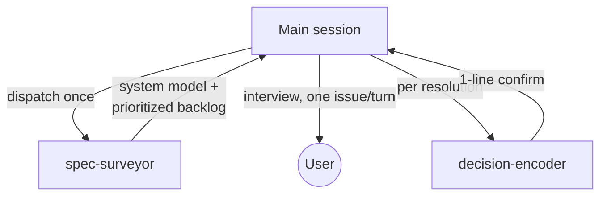

# Spec Sharpener

Turn a fuzzy early-stage specification into one that a competent engineer could
implement without having to guess. This is an **interview-and-edit** workflow,
not a report generator. The deliverable is the sharpened documents themselves.
This skill runs **before** implementation — nothing is expensive to reverse yet
— so no resolution warrants an Architecture Decision Record: the spec edit *is*
the durable record, and this skill never writes ADRs. (Recording ADRs during
the build is the milestone-driven skills' job.)

## Architecture: keep the main session lean

The interview is the only part that *must* live in this (the main) session,
because it's the conversation with the user. The two expensive, context-heavy
parts are delegated to subagents so their bulk never sits in your context:

- **`spec-surveyor`** (read-only) does the discovery, model-building, and sweep,
  and hands back a compact, prioritized backlog — each finding already carrying
  its quoted anchor, the problem, why it matters, and concrete options. All the
  doc text and the taxonomy stay inside that subagent and are discarded.
- **`decision-encoder`** (write) takes one resolved finding plus the agreed
  resolution and does the file work — makes the minimal edits to the affected
  docs — returning a one-line confirmation. The edited section body never
  enters your context.

So your job is: dispatch the surveyor once, hold the compact backlog, run the
interview loop, and dispatch the encoder once per resolution. You never load
the full corpus.

## When this applies

The project is greenfield: docs/spec exist, but there is no real implementation
yet — at most boilerplate (a scaffolded repo, a `package.json`, an empty folder
structure). The goal is to make the *specification* implementation-ready. The
boilerplate is treated as a signal (what framework, what naming, what shape was
assumed), not as the thing being refined.

Expect to be run **multiple times**. Each run picks up where the last left off,
reads what has already been decided, and keeps going until nothing material
remains.

## Core principles

- **One issue at a time, deeply.** Surface a single finding per turn, resolve it
  fully, then move on. Never dump the whole backlog as a list.
- **Always propose concrete options.** Don't just point at a problem. Offer 2–4
  specific resolutions with their trade-offs so the user has something to react
  to. A good option list does most of the thinking for them.
- **Edit in place, incrementally.** When a finding is resolved, make the
  smallest edit to the real document that encodes the decision. Preserve the
  doc's voice and structure. Don't rewrite whole sections wholesale.
- **The spec is the record.** Every resolution lands durably in the document
  text itself — that's what stops future runs from re-litigating it. No ADRs:
  once the text says one unambiguous thing, the finding cannot recur, and any
  rationale worth keeping is one line the spec itself can carry. If a project
  already has a decision log (e.g. from `/project-inception`), it is a
  read-only input — the surveyor uses it to drop already-settled findings, and
  nothing here appends to it.
- **Never invent intent.** Where the spec is silent, ask — don't quietly fill
  the gap with an assumption. The user is the source of truth for what they want.
- **Sharpen, don't plan.** This skill clarifies *what the system is* — it never
  plans *how or in what order it gets built*. Don't iterate over milestones,
  propose a sequencing, or ask what a reasonable first increment would be.
  Prioritization and phasing come later, in `/strategic-planning` and
  `/milestone-breakdown`. A scope question here is only ever *"is this part of
  the spec?"*, never *"what do we build first?"*.
- **Flag everything, but in priority order.** The bar for flagging is low (down
  to wording and style), but the order is strict: things that *block* a build
  come before things that would *fork* a build, which come before clarity, which
  comes before pure wording.

## Workflow

### Step 0 — Scope the survey (`$ARGUMENTS`)

`$ARGUMENTS` names the specification documents to assess — a path or glob, or
several. It is **optional**:

- **Given:** treat that set as the scope. Pass the exact paths/globs to the
  surveyor and tell it to confine its sweep to them (it may still read the
  decision log and scaffolding config as *context* for building its model, but
  it flags findings only within the named docs).
- **Omitted:** the default — the surveyor discovers and assesses every reasonable
  specification document itself (its normal behaviour).

For a **large or unfamiliar repo** where you can't tell up front what counts as
"the spec", don't guess and don't page the whole tree into your own context:
first dispatch a lightweight discovery agent (the read-only `Explore` agent) to
return a **list of candidate spec documents, each with a one-line summary**.
Show that list, confirm the scope with the user (or pick the obvious spec set
and say so), then feed the confirmed paths to the surveyor as if they'd been
passed in `$ARGUMENTS`. Skip this discovery hop for small repos — the surveyor's
own discovery is enough.

### Step 1–2 — Survey (delegated to `spec-surveyor`)

Do **not** read the docs, the decision log, or the taxonomy yourself. Instead
dispatch the `spec-surveyor` subagent via the `Agent` tool
(`subagent_type: spec-surveyor`). Give it the repo root, the document scope from
Step 0 (or "all reasonable docs" when none was given), and, on a re-run, a
one-line note of what previous runs already covered.

It returns a **system-model paragraph** and a **compact, prioritized backlog** in
which each finding already carries its quoted anchor, the problem, why it matters,
and 2–4 concrete options. If the project has a decision log, the surveyor has
already dropped findings settled by `Accepted` decisions.

Hold that backlog as your working state for this run. It is compact by design —
this is what keeps your context lean. Do **not** print it as a list, and do
**not** re-read the docs to "verify" it; trust the survey and only Read a specific
spot on demand if the interview genuinely needs the live text (e.g. the user asks
exactly what the doc says today).

If the survey reports no blockers or fork-risks and only trivial-or-nothing
remains, skip to the wrap in Step 6 and tell the user the spec looks
implementation-ready.

### Step 3 — Open the interview

Give the user a one-line orientation only — a rough tally, e.g. *"I went through
the spec and found around a dozen things, from a couple of real blockers down to
some wording. Let's take them strongest-first, one at a time."* Then go straight
into the first (highest-priority) issue. No findings report.

### Step 4 — The interview loop (per issue)

For each finding, present it in this shape:

> **Where:** `path/to/doc.md` — quote or pinpoint the exact spot.
> **What:** State the problem plainly (the ambiguity / contradiction / gap).
> **Why it matters:** Make it concrete — e.g. *"a developer could reasonably
> read this as X or as Y, and would build two different things."*
> **Options:** 2–4 concrete resolutions, each with a one-line trade-off. Mark a
> recommended default when you genuinely have one.
> **Your call:** Ask them to pick an option, blend them, or give their own.

Adapt the mode to the kind of finding:
- **Spec is silent (a gap):** you're eliciting their intent — options are
  educated guesses to react to.
- **Internal contradiction:** show both conflicting statements and ask which one
  wins (or whether both are partly right).
- **Pure wording/clarity:** propose a precise rewrite for a yes/no.

Then **keep going until there is genuine shared understanding.** If the user is
unsure, refine the options, ask a narrowing question, or surface a consideration
they may not have weighed. Do not move on while they're still hedging. One
finding may take several turns — that's expected and good.

### Step 5 — Encode the decision (delegated to `decision-encoder`)

Once the user confirms a resolution, do **not** edit the docs yourself.
Dispatch the `decision-encoder` subagent (`subagent_type: decision-encoder`)
with:

- the finding (title, affected doc(s), the verbatim quoted anchor, why it
  mattered — straight from the backlog item),
- the **agreed resolution** in prose (the option chosen, a blend, or the user's
  own answer — whatever was actually settled).

It makes the minimal edits to all affected docs so they now state the
resolution unambiguously, and returns a one-line `ENCODED: <title>`
confirmation. The sharpened text is the entire record — no ADR is written.
Relay the confirmation to the user in a sentence — don't paste the document
back.

Encoders run **one at a time**, never in parallel: the interview is sequential,
and successive resolutions may touch the same document. If it returns
`BLOCKED:` (e.g. the anchor no longer matches), read the reason, resolve it
with the user or by a quick targeted Read, and re-dispatch.

### Step 6 — Next, or wrap

Move to the next highest-priority finding and repeat Step 4. Continue until the
user wants to pause or the backlog is exhausted for this run. When you pause,
give a one-line status: how many resolved this run, how many remain, and the
nature of what's left.

## Relationship to the decision log

This skill **never writes** to the project's decision log (the architecture home,
`architecture/` by default, or the `architecture-path:` directory set in `CLAUDE.md`). It
runs pre-implementation,
where every resolution is cheap to change and the sharpened spec text is the
durable record. ADRs enter a project's life later, when the milestone-driven
skills (`/project-inception`, `/strategic-planning`, `/milestone-breakdown`)
make decisions that split the architecture or foreclose expensive-to-reverse
alternatives.

An **existing** decision log is respected as read-only input: the
`spec-surveyor` reads it to drop findings already settled by `Accepted`
decisions, and flags (rather than re-litigates) any new contradiction between
the spec and a settled decision.

## Re-running

On every run: re-dispatch the `spec-surveyor` (it re-reads the docs *and* the
decision log, rebuilds the model, re-sweeps, and drops anything already settled),
then continue the interview on what remains — including new issues introduced by
recent edits. The fresh survey runs in the subagent and is discarded, so re-runs
stay cheap for your context. When the survey turns up no remaining blockers or
fork-risks and only trivial-or-nothing is left, say so plainly: the spec looks
implementation-ready, with a note on any residual minor items the user chose to
leave.

## What not to do

- **Don't produce a standalone findings report** as the deliverable. The output
  is the interview plus the edits.
- **Don't dump the backlog.** One issue per turn.
- **Don't edit ahead of agreement.** No change lands until the user confirms it.
- **Don't advance prematurely.** Resolve and encode the current issue (i.e. get
  the encoder's `ENCODED` confirmation) before starting the next one.
- **Don't do the surveyor's or encoder's work yourself.** Don't read the whole
  corpus to sweep, and don't hand-edit docs in the main session — that
  reintroduces the context bloat this design removes. Reserve direct Reads for
  a single spot the live interview genuinely needs.
- **Don't write ADRs.** Not even for big calls — pre-implementation, the spec
  edit is the record. An ADR per resolution buries the decisions that matter
  under dozens that don't and pads trivial calls with fabricated "alternatives
  considered". If a resolution's rationale is genuinely worth keeping, give it
  a sentence in the spec itself.
- **Don't plan or prioritize.** No milestones, no sequencing, no MVP-vs-later,
  no "what's a reasonable first increment." That's the job of
  `/strategic-planning` and `/milestone-breakdown`, later. If the interview
  starts drifting into build order, pull it back to what the spec *says*.
- **Don't fabricate requirements.** Silence in the spec is a question for the
  user, not a license to decide for them.
- **Don't re-open settled decisions** without cause.
