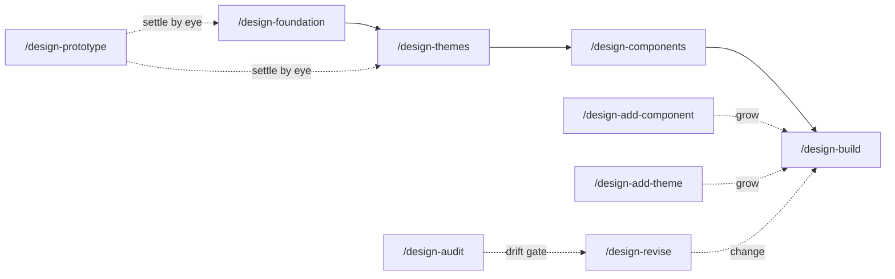

# Design-System Workflow

Takes a mixture of design references (live sites, local mocks/exports, named design systems) plus Socratic dialog to a **themable design system of pure HTML/CSS Tailwind components** under `design-system/` in the target project — browsable kitchen-sink pages that a consuming project later lifts into a real component library. No JavaScript, no build step: pages load the Tailwind v4 browser CDN, so everything opens from disk.

## The theme model

One idea carries the whole workflow: **every component has exactly one DOM, shared across all themes.** Structure, ordering, ARIA wiring, and sample content are byte-identical in every theme directory; a theme varies only the Tailwind `class` attributes and the `--ds-*` CSS-custom-property tokens in its `index.css`. A list may render one-per-row in one theme and two-column in another — through classes alone, never through different elements. This is what makes re-theming free (value changes propagate through the vars with zero markup edits) and what keeps the family auditable (a DOM diff between themes is by definition a bug).

A **theme** is a `<theme>-light`/`<theme>-dark` directory pair — mode is baked into the directory, never a runtime toggle, so a dark mode is simply a different `index.css` (designed, not inverted; no `dark:` variants, no media queries).

Accessibility and i18n are baked in, not bolted on: WCAG 2.2 AA is the floor (every `on-<x>`/`<x>` token pair ≥ 4.5:1, semantic elements first, `focus-visible` everywhere), and every component block ships an RTL sample (`dir="rtl"`), a long-string sample (`data-ds-sample="long"`), locale-format slots (`data-ds-locale`), and logical direction classes only (`ms-*`/`text-start`/…, with `data-ds-physical` as the explicit opt-out). The canonical contract is the bundled conventions doc: `skills/design-audit/references/conventions.md`.

## The pipeline



1. **`/design-foundation`** — reference intake + Socratic dialog → `FOUNDATION.md`, the design brief every later phase grounds in. References (live URLs via Chrome screenshots, local images/exports, named systems like "shadcn-ish") are fanned out to `reference-analyst` subagents, one each in parallel; the digests are persisted as `references.md` with a synthesis section (where the references agree, where they conflict, what none cover). The dialog then works one topic at a time — personality (falsifiable adjectives; they become the visual-critic's rubric), audience & density, color and typography *direction* (not hex — tokens are the next phase's job), shape/depth/motion, a11y and i18n baselines, theme axes (which themes exist and why each earns existence), and the catalog trim against the bundled standard catalog. Whenever a topic stalls on words, it offers a `/design-prototype` loop instead of debating. Re-entrant: with a `FOUNDATION.md` present it revises in dialog rather than re-founding.
2. **`/design-themes`** — turns the foundation's theme axes into concrete themes. Each theme is seeded by a `theme-drafter` subagent as a **complete light+dark token strawman** — every `--ds-*` value filled in, contrast self-computed and pre-checked, every choice tagged *grounded* (dictated by the foundation or a reference, with the source named) or *invented* (the drafter chose — an open question for the interview). Refinement leads with the eye (a `/design-prototype` render of the drafted set), then walks the invented annotations one at a time; contrast is non-negotiable. Writes `THEMES.md` plus each mode's `index.css` (`:root { --ds-* }` + minimal base styles) and `tokens.md` (token table, font stacks with script-coverage rationale), gated by `design-check.sh`. Re-entrant: revises existing themes diff-oriented.
3. **`/design-components`** — specs the catalog into `COMPONENTS.md`: a machine-readable `## Catalog` list (`- \`slug\` — one-liner`, kitchen-sink order — the exact grammar `assemble.sh` and `design-check.sh` parse) plus a section per component covering anatomy (the one shared DOM), variants, states, accessibility contract, i18n slots, and what themes may legitimately vary. Seeded from the bundled standard catalog (`skills/design-components/references/standard-catalog.md`) trimmed per `FOUNDATION.md`; the human is interviewed only on the genuinely open calls. Spec only — no HTML.
4. **`/design-build`** — the cycle skill (`[<limit>|all][@<workers>]`, default `all@4`): fans `component-smith` workers out **one per component**, each building that component across **every** theme — one worker owning all of a component's themes is what keeps the DOM identical between them. Workers write only marker-delimited fragments under `.fragments/<slug>/`; only `assemble.sh` writes an `index.html`. After each batch: deterministic assembly of every theme's kitchen-sink plus the root index, then the `design-check.sh` gate (component-attributable FAILs earn one smith respawn with the FAIL lines quoted; token FAILs are routed to the theme skills). Closes with a `visual-critic` rendering pass and deletes the fragments. Resumable and idempotent — the worklist is re-derived from `assemble.sh missing` each pass, so an interrupted build just resumes.
5. **`/design-prototype`** — out-of-band and mid-dialog: renders 2–3 candidate directions (palettes, font pairings, token sets) side by side — swatch rows with printed contrast ratios, type specimens, a few approximate sample components, light + dark — as ONE self-contained HTML file in a temp location (never under `design-system/`), opens it for the human, and reports the verdict back to the caller. Deliberately disposable: only the decision survives, recorded by the caller in `FOUNDATION.md` or the tokens.
6. **`/design-add-component`** — post-hoc entry point: spec one new component Socratically (seeded from the standard catalog when it's a known pattern), append it to `COMPONENTS.md`'s catalog and sections, build it across every theme via one `component-smith`, re-assemble, gate, and run a critic pass scoped to the new slug.
7. **`/design-add-theme`** — post-hoc entry point for a whole new theme: optional new references (appended to `references.md`), a `theme-drafter` strawman constrained to be a **deliberate sibling** of the existing themes (shared bones, articulated divergence), Socratic refinement with prototypes, then a per-component `component-smith` fan-out targeting only the new pair — each smith handed an assembled sibling's block as **existing-DOM source** to reuse verbatim, so the family stays structurally identical. The critic's close-out rubric includes cross-theme identity: do the siblings read as a family?
8. **`/design-revise`** — post-hoc entry point for both axes. *Theme tokens:* value-only changes (same names, new values) propagate free through the CSS vars — edit `index.css`/`tokens.md` and done; renamed/removed tokens trigger a grep for the old var plus a targeted smith pass over the referencing components. *Component structure:* the spec is updated first in `COMPONENTS.md` (markup never leads the spec), then rebuilt across every theme. Both axes carry a **foundation-drift check** — a change contradicting `FOUNDATION.md` is named before it's encoded; the human narrows the change or consciously revises the foundation first, never a silent divergence.
9. **`/design-audit`** — the standing drift gate, read-only: full `design-check.sh` over every theme plus a `visual-critic` rendering pass, merged into one severity-ranked report (FAIL → major visual → WARN → MISS → nits) where **every finding carries its route** — the entry point that fixes it (`/design-revise` for tokens or markup, `/design-build` for MISS components, `/design-components` for spec contradictions, the owning phase skill for doc drift). Run after hand edits, after time, or before a consuming project lifts the system. Reports and routes; fixes nothing.

Uses **`common`**'s `/commit` (the single commit point — no design-system skill commits directly). **The `common` workflow must be installed alongside `design-system`.**

## The deterministic backbone

Two bundled shell helpers carry everything that must not depend on model judgment:

**`assemble.sh`** (in `skills/design-build/`) — deterministic assembly. Every component block in a kitchen-sink is delimited by an exact marker pair:

```html
<!-- component: button -->
<section id="component-button" aria-labelledby="component-button-h">…</section>
<!-- /component: button -->
```

The markers are the resumability and revision contract: builds derive their worklist from them, and a revision replaces exactly one block. Commands (`bash <skills-root>/design-build/assemble.sh <cmd> …`):

| command | does |
|---|---|
| `catalog <ds-dir>` | print catalog slugs in kitchen-sink order (parsed from `COMPONENTS.md`'s `## Catalog`) |
| `missing <ds-dir> <theme-dir>` | slugs with neither a fragment nor an existing marker block — the build worklist |
| `assemble <ds-dir> <theme-dir>` | rebuild the theme's `index.html`: page shell + one block per slug, from the fragment if present, else carried over from the existing page |
| `index <ds-dir>` | rebuild the root `index.html` linking every theme dir |

**`design-check.sh`** (in `skills/design-audit/`) — the deterministic quality gate: `bash <skills-root>/design-audit/design-check.sh <ds-dir> [<theme-dir> …]`. Per theme it verifies the required `--ds-*` color roles, computes actual WCAG contrast (≥ 4.5:1) for every `on-<x>`/`<x>` hex pair, and checks `lang`/`dir` on `<html>`, the CDN + stylesheet links, marker integrity against the catalog, and per-block samples (RTL, long-string, ARIA, `focus-visible`, no physical direction classes). Output is one `OK|WARN|FAIL|MISS` line per finding; exit 1 iff any FAIL. The `visual-critic` subagent is its complement — it judges what math can't (hierarchy, rhythm, dark-mode legibility, personality fidelity).

## Files in the target project

```
design-system/
  FOUNDATION.md                # design brief (/design-foundation)
  THEMES.md                    # one section per theme: intent, key token rationale (/design-themes)
  COMPONENTS.md                # structural spec + machine-readable ## Catalog (/design-components)
  references.md                # persisted reference digests + synthesis (/design-foundation, appended later)
  index.html                   # root browser linking every theme dir (assemble.sh index)
  <theme>-<light|dark>/        # one directory per theme × mode
    index.html                 # marker-delimited kitchen-sink of every component (assemble.sh assemble)
    index.css                  # :root { --ds-* } tokens + minimal base styles
    tokens.md                  # human/agent-readable token documentation
  .fragments/<slug>/<theme-dir>.html   # build intermediates — smiths write, assemble.sh consumes, deleted after
```

## Subagents

Read-only (write nothing; the orchestrating skill does all writing):

- **`reference-analyst`** — distills ONE design reference per invocation into a visual-DNA digest (palette with roles, typography, density, shape/depth/motion, signature patterns, anti-patterns). Live URLs go through Chrome screenshots (tools loaded via ToolSearch) with WebFetch fallback; the raw pages never reach the orchestrator. For `/design-foundation` and `/design-add-theme`.
- **`theme-drafter`** — proposes ONE complete theme as a light+dark token strawman: every value concrete, a self-computed contrast table with pass/fail, font stacks with script-coverage notes, and every choice annotated grounded vs invented. Given sibling `tokens.md` files, it keeps the family coherent. For `/design-themes` and `/design-add-theme`.
- **`visual-critic`** — opens the assembled pages in Chrome via `file://`, screenshots them, and critiques what actually renders — hierarchy, spacing rhythm, dark-mode legibility, cross-component consistency, DOM-consistency across themes, RTL sanity, fidelity to `FOUNDATION.md`'s adjectives. Returns severity-tagged findings keyed to theme + component anchor; falls back to a limited markup read when no browser is connected. For `/design-build`, `/design-add-component`, `/design-add-theme`, `/design-revise`, and `/design-audit`.

Write-side:

- **`component-smith`** — builds ONE component across all target themes: the DOM designed once, kept byte-identical, only classes varying per theme. Writes only `.fragments/<slug>/<theme-dir>.html` — never an `index.html`, never the spec, never a theme's tokens — so parallel smiths can't collide and only `assemble.sh` writes assembled pages. Every block ships the full sample set (all variants and states, focus-visible, RTL, long-string, locale slots), logical classes only, every color through a token. Given an existing-DOM source it reuses that DOM verbatim and only restyles.

## Concurrency & ownership

- **One smith owns one component across ALL themes** — never split a component's themes across workers; the shared DOM depends on it.
- **Smiths write only fragments; only `assemble.sh` writes pages.** Distinct slugs write to distinct fragment dirs, so a parallel batch never collides.
- **Worklists are derived, never remembered** — `/design-build` and `/design-add-theme` recompute from `assemble.sh missing` each pass, making the cycles resumable and idempotent.
- **The spec leads the markup.** Structural change flows `COMPONENTS.md` → rebuild, never the other way; `FOUNDATION.md` outranks both (the drift check).

## Install

```bash
./install.sh design-system            # global (~/.claude)
./install.sh design-system /path/proj # into a project
./install.sh common /path/proj        # REQUIRED alongside — provides /commit
```
