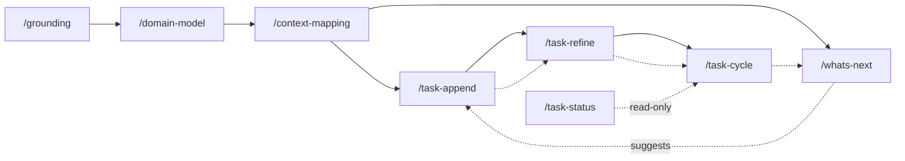

# Domain-Driven Workflow

A build workflow that takes a project from a blank page to shipped code through
**Domain-Driven Design** strategic modeling, then drives a **dependency-ordered
task backlog** to completion with TDD workers. It favors *flow* over *batches*:
there is no milestone layer — just a growing backlog whose scheduling is governed
by an explicit dependency DAG, and whose primary axis of organization is the
project's **bounded contexts**.

## The pipeline



1. **`/grounding`** — a Socratic vision session (adapted from the Agentheim
   brainstorm skill). Produces a single tight `vision.md` and stops there — every
   later phase is deliberately separate so the human keeps control of each.
2. **`/domain-model`** — big-picture **EventStorming**: a chronological domain-event
   timeline (marking events that originate outside the software and the situation
   that triggers each), the commands/actors that trigger the in-software ones,
   policies, external systems, the **aggregates** that own consistency, and a
   **hotspots** list of unresolved decisions. Seeded by the `domain-seed-extractor`
   subagent, refined Socratically.
   Offers to turn hotspots into ADRs. Produces `domain-model.md`.
3. **`/context-mapping`** — draws the **bounded contexts** around the model's
   aggregate clusters, and records the **relationships** between them (partnership,
   customer/supplier, conformist, ACL, published language, shared kernel) plus each
   context's **ubiquitous language**. Seeded by the `boundary-proposer` subagent.
   Produces `context-map/INDEX.md` + `context-map/<context>.md`.
4. **`/task-append`** — captures a task into the backlog as a `draft`, from human
   input of any quality (a polished spec or a raw brain-dump). Low-friction; no
   interview.
5. **`/task-refine`** — turns a `draft` into a ready `todo`: assesses completeness,
   **domain-compliance**, and size (delegated to the `task-analyzer` subagent);
   interviews the human; **splits** oversized tasks; wires **dependencies**;
   surfaces decisions and attaches ADRs.
6. **`/task-cycle`** — drives ready `todo` tasks to `done` via `task-worker`
   subagents (strict TDD → verify → commit). `all@1` works in-place sequentially;
   `@N` implements in parallel git worktrees and merges back sequentially via the
   `integrator` subagent (bounce-on-conflict).
7. **`/task-status`** — read-only backlog board (the human front end to `tasks.sh`).
8. **`/whats-next`** — the forward-looking companion to `/task-status`: assesses
   `vision.md`, `domain-model.md`, and `context-map/` against the backlog state
   (read through `tasks.sh`, frontmatter only), surfaces coverage gaps (uncovered
   aggregates, thin contexts, unrepresented vision outcomes, blocking hotspots), and
   proposes a prioritized list of next tasks. **Advisory** — it hands approved
   suggestions to `/task-append` and mints/wires/refines nothing itself.

Uses **`common`**'s `/adr` (record decisions) and `/commit` (the single commit
point). **The `common` workflow must be installed alongside `domain-driven`.**

## Files in the target project

```
vision.md                     # /grounding
domain-model.md               # /domain-model
context-map/
  INDEX.md                    # overview + relationship map (mermaid)
  <context>.md                # per-context: responsibility, boundary, relationships, ubiquitous language
decisions/                    # ADRs (shared convention with common/adr; default dir, override via `decision-path:` in CLAUDE.md)
  INDEX.md
  NNNN-title.md
tasks/
  NNNN-slug.md                # one task per file; frontmatter is the query index
```

### Task file schema

```markdown
---
id: "0007"                    # documentation; canonical id is the NNNN filename prefix
title: Cargo workspace setup
status: draft                 # draft | todo | in progress | done | split
context: build                # a context-map slug (empty until refined)
created: 2026-07-13T14:22:00Z
completed: ""                 # set when done
depends_on: ["0003", "0005"]  # task ids
related_adrs: [2]             # ADR numbers
related_documents: [context-map/build.md]
split_into: []                # child ids, only on a `split` tombstone
---

## Outcome
### Why this matters
### Acceptance criteria
## Implementation plan     # added by /task-refine (ordered steps + files to touch)
### Interfaces             # added by /task-refine (HTTP/gRPC/traits/… touched)
## Notes
## Closing                 # implementation-phase record
### Manual testing         # filled at implementation by /task-cycle
### Deviations from plan   # filled at implementation by /task-cycle
```

`## Implementation plan` (with its `### Interfaces` subsection) is added by
`/task-refine` when the draft becomes a `todo`; a freshly captured draft has only
the `## Outcome`, `## Notes`, and `## Closing` groups. The `## Closing` group holds
the **implementation-phase records**: empty placeholders at capture, filled by
`/task-cycle` from the `task-worker`'s report when the task lands
(human-verification/demo steps, and where the shipped code departed from the spec).

**Task lifecycle:** `draft →(refine) todo →(cycle claim) in progress →(cycle
complete) done`. A task judged too big is **split**: its children are minted as new
`todo` tasks, and the original becomes an inert `split` **tombstone** recording
`split_into`; dependents are then rewired to the correct children in a separate pass
(a dependent left pointing at a tombstone is a dangling edge that `check-dag`
rejects).

## The scaling law: never scan the backlog

The backlog can grow large. **No skill or subagent ever reads the task corpus (or a
filtered slice of it) by scanning files.** Every question about the backlog is
answered by the deterministic **`tasks.sh`** helper (bundled in the `task-status`
skill directory), which parses only YAML frontmatter (`yj -yj` → `jq`) and returns
ids/paths/counts. Task **frontmatter is the query index; prose bodies are read only
by the one worker implementing that one task.**

Invoke as `bash <skills-root>/task-status/tasks.sh <command> [--dir tasks]`:

| command | returns |
|---|---|
| `ready` | `todo` tasks whose every `depends_on` is `done` — the scheduler's ready-set |
| `next-id` | next free 4-digit id |
| `by-status <s>` / `by-context <c>` | matching task ids |
| `get <id>` | one task's frontmatter as JSON |
| `blockers <id>` / `dependents <id>` | unmet deps / reverse edges |
| `check-dag` | exit 0 iff acyclic and no dangling refs (else prints the problem) |
| `board` | one summary line of counts per status |

Ids are derived from the `NNNN-` **filename** prefix (dodging YAML octal parsing of
leading-zero numbers); `depends_on`/`split_into` are normalized to 4-digit strings
regardless of how the frontmatter wrote them. Requires `yj` and `jq` on `PATH`.

`check-dag` is a hard gate: `/task-refine` runs it after wiring dependencies (it
must not leave a cycle or a dangling edge), and `/task-cycle` runs it at preflight
(an unschedulable backlog is refused until refine fixes it).

## Concurrency & status ownership

- **The orchestrator owns every status write.** `task-worker` implements and commits
  code but never edits a task's `status`/`completed`; `/task-cycle` writes all
  transitions. This keeps the enum single-writer and race-free.
- **`/task-append` and `/task-refine` are human-serial** — id minting and the
  split/rewire passes assume no concurrent invocation.
- **`@N > 1` = parallel implementation, serial integration, bounce-on-conflict.**
  Workers build in isolated worktrees; the `integrator` merges branches onto base
  one at a time and never auto-resolves a conflict — a bounced task is simply redone
  on a later pass.

## Subagents

Read-only proposal scouts (`Read, Glob, Grep`; write nothing, decide nothing):
- **`domain-seed-extractor`** — first-pass EventStorm from `vision.md`.
- **`boundary-proposer`** — first-pass context map + relationships from the model.
- **`task-analyzer`** — refine assessment (completeness, domain-compliance, size,
  deps, decisions/ADRs) for one task.

Write-side workers:
- **`task-worker`** — TDD-implements one task and commits it (`Read, Edit, Write,
  Glob, Grep, Bash, Skill`).
- **`integrator`** — sequential worktree merge-back, bounce-on-conflict (`Bash,
  Read`).

## Install

```bash
./install.sh domain-driven            # global (~/.claude)
./install.sh domain-driven /path/proj # into a project
./install.sh common /path/proj        # REQUIRED alongside — provides /adr and /commit
```
