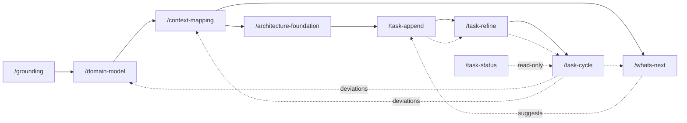

# Domain-Driven Workflow

A build workflow that takes a project from a blank page to shipped code through **Domain-Driven Design** strategic modeling, then drives a **dependency-ordered task backlog** to completion with TDD workers. It favors *flow* over *batches*: there is no milestone layer — just a growing backlog whose scheduling is governed by an explicit dependency DAG, and whose primary axis of organization is the project's **bounded contexts**.

## The pipeline



1. **`/grounding`** — a Socratic vision session (adapted from the Agentheim brainstorm skill). Produces a single tight `vision.md` and stops there — every later phase is deliberately separate so the human keeps control of each.
2. **`/domain-model`** — big-picture **EventStorming**: a chronological domain-event timeline (marking events that originate outside the software and the situation that triggers each), the commands/actors that trigger the in-software ones, policies, external systems, the **aggregates** that own consistency, and a **hotspots** list of unresolved decisions. Seeded by the `domain-seed-extractor` subagent, refined Socratically. Offers to turn hotspots into ADRs. Produces `domain-model.md`. **Re-entrant:** when the model already exists it runs in *revision mode* — diff-oriented, fed by the drift worklist (see *Model evolution* below) — instead of re-storming from scratch.
3. **`/context-mapping`** — draws the **bounded contexts** around the model's aggregate clusters, and records the **relationships** between them (partnership, customer/supplier, conformist, ACL, published language, shared kernel) plus each context's **ubiquitous language**. Seeded by the `boundary-proposer` subagent. Produces `context-map.md` + `bounded-contexts/<context>.md`. **Re-entrant:** when the map already exists it runs in *revision mode*, and closes with a **backlog ripple pass** — live tasks touched by a renamed context are mechanically re-slugged; tasks touched by a split/merge are flagged for `/task-refine` to re-home.
4. **`/architecture-foundation`** — a Socratic session that defines the project's **architectural boundaries and guidelines** from the vision + domain model + context map, general → specific: tech stack (languages/frameworks/runtimes), persistence/data stores, communication & integration between contexts, testing principles, and cross-cutting concerns (error handling, observability, security, configuration, versioning, deployment). Seeded by the `architecture-proposer` subagent; records each decision as an ADR (via `/adr`), which keeps the crisp per-topic summaries under `architecture/` in sync. Makes artifact/environment/ bounded-context binding explicit. These guidelines are the guardrail every task is later checked against.
5. **`/task-append`** — captures a task into the backlog as a `draft`, from human input of any quality (a polished spec or a raw brain-dump). Low-friction; no interview.
6. **`/task-refine`** — turns a `draft` into a ready `todo`: assesses completeness, **domain-compliance**, and size (delegated to the `task-analyzer` subagent); interviews the human; **splits** oversized tasks; wires **dependencies**; surfaces decisions and attaches ADRs.
7. **`/task-cycle`** — drives ready `todo` tasks to `done` via `task-worker` subagents (strict TDD → verify → commit). `all@1` works in-place sequentially; `@N` implements in parallel git worktrees and merges back sequentially via the `integrator` subagent (bounce-on-conflict). When a landed task's *Deviations from plan* record is non-trivial, sets `deviated: true` in its frontmatter — producing the drift worklist the model revisions consume.
8. **`/task-status`** — read-only backlog board (the human front end to `tasks.sh`).
9. **`/whats-next`** — the forward-looking companion to `/task-status`: assesses `vision.md`, `domain-model.md`, and `context-map.md` against the backlog state (read through `tasks.sh`, frontmatter only), surfaces coverage gaps (uncovered aggregates, thin contexts, unrepresented vision outcomes, blocking hotspots, **model drift** — an accumulating `deviated` worklist, dangling context slugs, suggestions that fit no context), and proposes a prioritized list of next tasks. When drift dominates, its top recommendation is a `/domain-model` or `/context-mapping` revision rather than more tasks onto a stale model. **Advisory** — it hands approved suggestions to `/task-append` and mints/wires/refines nothing itself; it reads the drift flags but never clears them.

Uses **`common`**'s `/adr` (record decisions) and `/commit` (the single commit point). **The `common` workflow must be installed alongside `domain-driven`.**

## Model evolution: the loop back

The strategic artifacts are hypotheses until code tests them, so the pipeline is a loop, not a line. The feedback channel is the **`deviated` marker** — a worklist flag with one producer and one consumer:

- **Produce.** When `/task-cycle` lands a task whose worker reported a non-trivial *Deviations from plan* record, it sets `deviated: true` in that task's frontmatter. Each flag marks a place where the spec met reality and lost.
- **Query.** `tasks.sh deviated` lists the flagged `done` tasks — the drift worklist. `/whats-next` reads it (plus dangling context slugs and fit-friction) as a first-class *model drift* gap and, when drift dominates, recommends a revision run instead of proposing more tasks.
- **Consume.** A `/domain-model` or `/context-mapping` **revision** (either skill re-invoked while its artifact exists) reads exactly the flagged tasks' `## Closing` sections, asks what each deviation implicates (an event, an aggregate boundary, a context boundary, or nothing model-level), folds the lessons in diff-oriented — untouched parts of the model stand — and clears the flags it handled.

Revisions stay human-invoked Socratic sessions — `/whats-next` only recommends them — and reversals of earlier recorded decisions are captured as superseding ADRs. A `/domain-model` revision that reshapes aggregate clusters ends by pointing at `/context-mapping` (the map is stale by construction); a `/context-mapping` revision that changes boundaries ends with the backlog ripple pass (mechanical re-slug on rename, flag-for-`/task-refine` on split/merge).

## Files in the target project

```
vision.md                     # /grounding
domain-model.md               # /domain-model
context-map.md                # overview + relationship map (mermaid)
bounded-contexts/
  <context>.md                # per-context: responsibility, boundary, relationships, ubiquitous language
architecture/                 # architecture home (shared convention with common/adr; default dir, override via `architecture-path:` in CLAUDE.md)
  decisions.md                # ADR index
  decisions/
    NNNN-title.md             # full ADRs
  <topic>.md                  # crisp per-topic guideline summaries (tech-stack, testing, …), derived from the ADRs by /architecture-foundation + /adr
tasks/
  NNNN-slug.md                # one task per file; frontmatter is the query index
```

### Task file schema

```markdown
---
id: "0007"                    # documentation; canonical id is the NNNN filename prefix
title: Cargo workspace setup
status: draft                 # draft | todo | in progress | done | split
context: build                # a bounded-context slug (empty until refined)
created: 2026-07-13T14:22:00Z
completed: ""                 # set when done
depends_on: ["0003", "0005"]  # task ids
related_adrs: [2]             # ADR numbers
deviated: false               # true when the task landed with non-trivial deviations (set by /task-cycle, cleared by a model revision)
related_documents: [bounded-contexts/build.md]
split_into: []                # child ids, only on a `split` tombstone
---

## Outcome
### Why this matters
### Acceptance criteria
## Implementation plan     # added by /task-refine (ordered steps + files to touch)
### Interfaces             # added by /task-refine (HTTP/gRPC/traits/… touched)
## Notes
## Closing                 # implementation-phase record
### Manual testing         # filled at implementation by /task-cycle
### Deviations from plan   # filled at implementation by /task-cycle
```

`## Implementation plan` (with its `### Interfaces` subsection) is added by `/task-refine` when the draft becomes a `todo`; a freshly captured draft has only the `## Outcome`, `## Notes`, and `## Closing` groups. The `## Closing` group holds the **implementation-phase records**: empty placeholders at capture, filled by `/task-cycle` from the `task-worker`'s report when the task lands (human-verification/demo steps, and where the shipped code departed from the spec).

**Task lifecycle:** `draft →(refine) todo →(cycle claim) in progress →(cycle complete) done`. A task judged too big is **split**: its children are minted as new `todo` tasks, and the original becomes an inert `split` **tombstone** recording `split_into`; dependents are then rewired to the correct children in a separate pass (a dependent left pointing at a tombstone is a dangling edge that `check-dag` rejects).

## The scaling law: never scan the backlog

The backlog can grow large. **No skill or subagent ever reads the task corpus (or a filtered slice of it) by scanning files.** Every question about the backlog is answered by the deterministic **`tasks.sh`** helper (bundled in the `task-status` skill directory), which parses only YAML frontmatter (`yj -yj` → `jq`) and returns ids/paths/counts. Task **frontmatter is the query index; prose bodies are read only by the one worker implementing that one task** — with one sanctioned exception: a `/domain-model` or `/context-mapping` revision reads the `## Closing` sections of exactly the ids `tasks.sh deviated` lists (a bounded, flag-gated worklist, not a scan).

Invoke as `bash <skills-root>/task-status/tasks.sh <command> [--dir tasks]`:

| command | returns |
|---|---|
| `ready` | `todo` tasks whose every `depends_on` is `done` — the scheduler's ready-set |
| `next-id` | next free 4-digit id |
| `by-status <s>` / `by-context <c>` | matching task ids |
| `deviated` | `done` tasks flagged `deviated: true` — the drift worklist for model revisions |
| `get <id>` | one task's frontmatter as JSON |
| `blockers <id>` / `dependents <id>` | unmet deps / reverse edges |
| `check-dag` | exit 0 iff acyclic and no dangling refs (else prints the problem) |
| `board` | one summary line of counts per status |

Ids are derived from the `NNNN-` **filename** prefix (dodging YAML octal parsing of leading-zero numbers); `depends_on`/`split_into` are normalized to 4-digit strings regardless of how the frontmatter wrote them. Requires `yj` and `jq` on `PATH`.

`check-dag` is a hard gate: `/task-refine` runs it after wiring dependencies (it must not leave a cycle or a dangling edge), and `/task-cycle` runs it at preflight (an unschedulable backlog is refused until refine fixes it).

## Concurrency & status ownership

- **The orchestrator owns every status write.** `task-worker` implements and commits code but never edits a task's `status`/`completed`; `/task-cycle` writes all transitions. This keeps the enum single-writer and race-free.
- **`/task-append` and `/task-refine` are human-serial** — id minting and the split/rewire passes assume no concurrent invocation.
- **`@N > 1` = parallel implementation, serial integration, bounce-on-conflict.** Workers build in isolated worktrees; the `integrator` merges branches onto base one at a time and never auto-resolves a conflict — a bounced task is simply redone on a later pass.

## Subagents

Read-only proposal scouts (`Read, Glob, Grep`; write nothing, decide nothing):
- **`domain-seed-extractor`** — first-pass EventStorm from `vision.md`.
- **`boundary-proposer`** — first-pass context map + relationships from the model.
- **`architecture-proposer`** — first-pass architecture agenda (tech stack, persistence, integration, testing, cross-cutting) from vision + domain model + context map, for `/architecture-foundation`.
- **`task-analyzer`** — refine assessment (completeness, domain-compliance, size, deps, decisions/ADRs) for one task.

Write-side workers:
- **`task-worker`** — TDD-implements one task and commits it (`Read, Edit, Write, Glob, Grep, Bash, Skill`).
- **`integrator`** — sequential worktree merge-back, bounce-on-conflict (`Bash, Read`).

## Install

```bash
./install.sh domain-driven            # global (~/.claude)
./install.sh domain-driven /path/proj # into a project
./install.sh common /path/proj        # REQUIRED alongside — provides /adr and /commit
```
