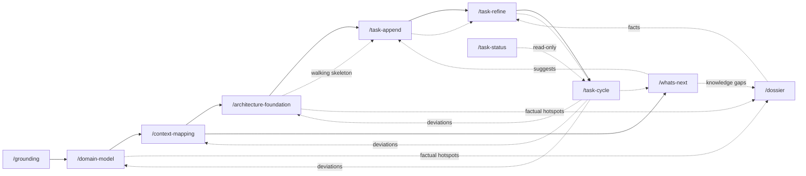

# Domain-Driven Workflow

A build workflow that takes a project from a blank page to shipped code through **Domain-Driven Design** strategic modeling, then drives a **dependency-ordered task backlog** to completion with TDD workers. It favors *flow* over *batches*: there is no milestone layer — just a growing backlog whose scheduling is governed by an explicit dependency DAG, and whose primary axis of organization is the project's **bounded contexts**.

## The pipeline



1. **`/grounding`** — a Socratic vision session (adapted from the Agentheim brainstorm skill). Produces a single tight `vision.md` and stops there — every later phase is deliberately separate so the human keeps control of each. If `common`'s `/spec-sharpener` is installed, running it on `vision.md` (plus any other human-authored input docs) between `/grounding` and `/domain-model` is the sanctioned sharpening slot: the seed extractors downstream inherit whatever ambiguity the vision carries. The sharpener treats this workflow's derived artifacts (`domain-model.md`, `context-map.md`, `bounded-contexts/`, `tasks/`) as read-only and routes findings about them to the owning skill's revision mode instead of editing them.
2. **`/domain-model`** — big-picture **EventStorming**: a chronological domain-event timeline (marking events that originate outside the software and the situation that triggers each), the commands/actors that trigger the in-software ones, policies, external systems, the **aggregates** that own consistency, and a **hotspots** list of unresolved decisions. Seeded by the `domain-seed-extractor` subagent, refined Socratically. Offers to turn hotspots into ADRs. Produces `domain-model.md`. **Re-entrant:** when the model already exists it runs in *revision mode* — diff-oriented, fed by the drift worklist (see *Model evolution* below) — instead of re-storming from scratch.
3. **`/context-mapping`** — draws the **bounded contexts** around the model's aggregate clusters, and records the **relationships** between them (partnership, customer/supplier, conformist, ACL, published language, shared kernel) plus each context's **ubiquitous language**. The domain model's **external systems** land on the same map as **external contexts** — upstream models the project doesn't own, each faced by exactly one owned context and bound by a realistic pattern (conformist, ACL, or published language; the boundary decision lives here, the system's observed behavior in a `/dossier`, sample payloads in `/exemplar`s). Tasks are never homed in an external context — integration work lands in the owned facing context. Seeded by the `boundary-proposer` subagent. Produces `context-map.md` + `bounded-contexts/<context>.md` (one file per context, owned or external). **Re-entrant:** when the map already exists it runs in *revision mode*, and closes with a **backlog ripple pass** — live tasks touched by a renamed context are mechanically re-slugged; tasks touched by a split/merge are flagged for `/task-refine` to re-home.
4. **`/architecture-foundation`** — a Socratic session that defines the project's **architectural boundaries and guidelines** from the vision + domain model + context map. Opens its agenda with the domain model's **still-open hotspots** — the last gate before the build phase, where each must be resolved (→ ADR), explicitly parked, or reclassified as non-architectural, so nothing unresolved silently survives into `/task-append`. Then works general → specific: tech stack (languages/frameworks/runtimes), persistence/data stores, communication & integration between contexts, testing principles, and cross-cutting concerns (error handling, observability, security, configuration, versioning, deployment). Seeded by the `architecture-proposer` subagent; records each decision as an ADR (via `/adr`), which keeps the crisp per-topic summaries under `architecture/` in sync. Makes artifact/environment/ bounded-context binding explicit. These guidelines are the guardrail every task is later checked against. Closes a first run by proposing a **walking-skeleton task** — one deliberately thin vertical slice exercising the stack, one persistence decision, and one context-map relationship end-to-end, handed to `/task-append` on approval — so wrong ADRs surface while superseding them is cheap. **Re-entrant:** with ADRs but no landed code it *extends* the foundation (picking up open decisions, not re-litigating settled ones); once tasks have landed it runs in *revision mode* — reading the architecturally-implicated entries of the drift worklist (see *Model evolution* below) and superseding the decisions reality contradicted.
5. **`/task-append`** — captures a task into the backlog as a `draft`, from human input of any quality (a polished spec or a raw brain-dump). Low-friction; no interview.
6. **`/task-refine`** — turns a `draft` into a ready `todo`: assesses completeness, **domain-compliance**, and size (delegated to the `task-analyzer` subagent); interviews the human; **splits** oversized tasks; wires **dependencies**; surfaces decisions and attaches ADRs.
7. **`/task-cycle`** — drives ready `todo` tasks to `done` via `task-worker` subagents (strict TDD → verify → commit). `all@1` works in-place sequentially; `@N` implements in parallel git worktrees and merges back sequentially via the `integrator` subagent (bounce-on-conflict). When a landed task's *Deviations from plan* record is non-trivial, sets `deviated: true` in its frontmatter — producing the drift worklist the revision runs consume.
8. **`/task-status`** — read-only backlog board (the human front end to `tasks.sh`).
9. **`/exemplar`** — out-of-band, invocable at any point after `/grounding` (the analog of `/adr`): brainstorms or intakes one **exemplar** — a concrete sample artifact (config file, dataset, payload, event, CLI transcript, UI mock) that pins a piece of the spec down in bytes. In *draft mode*, seeded by the `exemplar-drafter` subagent with a fully filled-in strawman (every value chosen, each tagged *grounded* — with its source — or *invented* — an open question); in *intake mode* (an existing artifact is provided — a sample HTML, a design export from Claude Design or Figma, a captured payload) the drafter annotates the provided bytes instead of inventing them, surfacing conflicts with the ubiquitous language and ADRs. Both refined Socratically one open value at a time and written to `exemplars/<slug>/` as `illustrative` — the artifact plus a `NOTES.md` whose *Pinned facts* + *Map* (durable anchors) sections are the consumption surface, so downstream agents (`task-analyzer`, `task-worker`) never read a large artifact whole. Also invoked by `/architecture-foundation` when the human accepts its "pin this decision with an exemplar?" offer. In intake mode the artifact's bytes land at `exemplars/<slug>/` up front and the main session never loads the artifact; intake settles a sync mode — `sync: upstream` keeps the copy a byte-exact snapshot of the export (corrections recorded as a *Fix upstream* list in `NOTES.md` for the human to carry back into the source tool; open items block promotion), `sync: detached` has the write-side `exemplar-scribe` subagent apply them to the bytes. Promotion to `normative` belongs to `/spec-sharpener` (see *Exemplars* below).
10. **`/dossier`** — out-of-band, invocable at any point after `/grounding` (the fact-side sibling of `/exemplar`): builds or extends a **dossier** — the project's fact file on one subject (what a regulation requires, what an undocumented API actually does), distilled into confidence-tagged, source-cited claims under `dossiers/<slug>.md`. Subject-keyed and **accreting**: entry vectors (an explicit question, a source to mine, a factual hotspot handed off by `/domain-model` or `/architecture-foundation`, a knowledge gap from `/whats-next`) all converge on the same subject file. Scoped by a human-confirmed **relevance frame** drawn from the vision, context map, and backlog frontmatter — the middle ground between answering inline and the full research workflow (whose KB, when present, it distills via lifted confidence rather than re-verifying). The sweep is delegated to the `dossier-scout` subagent (the only scout allowed on the web, and only when the confirmed source list sanctions it). Writes **no ADRs** — decisional unknowns the facts force are routed out to `/adr`, a hotspot, or the foundation agenda (see *Dossiers* below).
11. **`/whats-next`** — the forward-looking companion to `/task-status`: assesses `vision.md`, `domain-model.md`, and `context-map.md` against the backlog state (read through `tasks.sh`, frontmatter only), surfaces coverage gaps (uncovered aggregates, thin contexts, unrepresented vision outcomes, **unintegrated external systems** (an external context with no task building its integration, or one missing from the map entirely), blocking hotspots, an **unvalidated foundation** — architecture ADRs recorded but no landed task exercises them end-to-end, in which case a walking-skeleton vertical slice is the top proposal — **knowledge gaps** — fact-dependent territory no dossier covers, or dossiers with open unknowns / aging watermarks, routed to `/dossier` — and **drift** — an accumulating `deviated` worklist, dangling context slugs, suggestions that fit no context), and proposes a prioritized list of next tasks. When drift dominates, its top recommendation is a revision run rather than more tasks onto a stale model — `/domain-model` or `/context-mapping` for model drift, `/architecture-foundation` when the deviated tasks' `related_adrs` hint the friction is architectural. **Advisory** — it hands approved suggestions to `/task-append` and mints/wires/refines nothing itself; it reads the drift flags but never clears them.

Uses **`common`**'s `/adr` (record decisions) and `/commit` (the single commit point). **The `common` workflow must be installed alongside `domain-driven`.**

### No tactical-design phase, by decision

Strategic modeling stops at the context map. There is deliberately **no tactical-design phase** between `/context-mapping` and `/task-refine` — no up-front pass detailing each context's aggregate internals, invariants, entity/value-object breakdown, or event contracts. That detail is decided **just-in-time**, per task: `/task-refine`'s domain-compliance interview (via `task-analyzer`) checks the task against its context's ubiquitous language and relationships and pins down the invariants and interfaces *that task* touches, and `/task-cycle`'s TDD loop settles the rest in code. Anything that outlives the task — a cross-cutting event contract, a boundary-shaping invariant — becomes an ADR or a hotspot, and reaches the model through the revision loop below.

The tax of a full tactical pass up front is paid on detail that the first implementations invalidate; the pipeline's answer to that risk is the walking skeleton plus `deviated`-driven revision, not more modeling before code. If a project genuinely needs a designed-up-front aggregate — a hairy invariant several tasks depend on — the escape hatch is an ADR (via `/adr`) or a hotspot in `domain-model.md`, not a new phase.

## Model evolution: the loop back

The strategic artifacts — the domain model, the context map, *and the architecture foundation* — are hypotheses until code tests them, so the pipeline is a loop, not a line. The feedback channel is the **`deviated` marker** — a worklist flag with one producer and one family of consumers:

- **Produce.** When `/task-cycle` lands a task whose worker reported a non-trivial *Deviations from plan* record, it sets `deviated: true` in that task's frontmatter. Each flag marks a place where the spec met reality and lost.
- **Query.** `tasks.sh deviated` lists the flagged `done` tasks — the drift worklist. `/whats-next` reads it (plus dangling context slugs and fit-friction) as a first-class *drift* gap and, when drift dominates, recommends a revision run instead of proposing more tasks — using `related_adrs` on the deviated tasks as a frontmatter-only hint for whether the friction is architectural or model-shaped.
- **Consume.** A **revision** run — `/domain-model`, `/context-mapping`, or `/architecture-foundation` re-invoked while its artifact exists (for the foundation: ADRs plus landed tasks) — reads exactly the flagged tasks' `## Closing` sections, asks what each deviation implicates (an event, an aggregate boundary, a context boundary, an architectural decision, or nothing), folds the lessons in diff-oriented — untouched parts of the artifact stand — and clears the flags it fully handled. A deviation implicating more than one artifact keeps its flag until the remaining revision consumes it.

Revisions stay human-invoked Socratic sessions — `/whats-next` only recommends them — and reversals of earlier recorded decisions are captured as superseding ADRs. A `/domain-model` revision that reshapes aggregate clusters ends by pointing at `/context-mapping` (the map is stale by construction); a `/context-mapping` revision that changes boundaries ends with the backlog ripple pass (mechanical re-slug on rename, flag-for-`/task-refine` on split/merge).

The loop also has a feed-forward half: validation needs evidence, and the natural backlog can go a dozen tasks without exercising a single cross-context integration. The **walking skeleton** provides it — `/architecture-foundation` closes a first run by proposing one thin end-to-end slice through the freshly decided stack, persistence, and one context-map relationship, and `/whats-next` re-surfaces the gap (foundation ADRs present, nothing landed spans the map) until such a task lands. Wrong decisions thus meet reality while superseding them is cheap, and a later foundation revision has something real to chew on.

## Exemplars: the data twin of an ADR

An ADR records a decision in prose; an **exemplar** shows it in bytes — a sample config, dataset, payload, transcript, or UI mock under `exemplars/<slug>/` (the artifact in its native format — possibly several files, e.g. an HTML mock with CSS/assets or a design screenshot — plus a `NOTES.md` whose frontmatter carries the metadata of record, including a `source:` provenance line for intaken artifacts), indexed one line per exemplar in `exemplars/exemplars.md`. The linking is one-way — `NOTES.md`'s `related_adrs` points at the decisions the exemplar makes concrete; ADRs are never edited to point back.

One distinction carries the whole lifecycle: **`illustrative`** (a strawman that exists to be argued with; nothing binds to it) vs **`normative`** (binding — tasks cite it in acceptance criteria, `task-worker` lifts it as a first test fixture, and contradicting it is a spec bug).

- **Brainstorm or intake** — `/exemplar`, either invoked directly, offered by `/architecture-foundation` after a decision with a natural data shape (configuration, integration payload, persistence record) lands as an ADR, or handed an artifact that already exists (*intake mode*: a sample HTML, a Claude Design or Figma export/screenshot, a captured payload — the drafter annotates the provided bytes instead of inventing a strawman, and the interview leads with conflicts against the ubiquitous language / ADRs; live design-tool URLs are refused — the repo copy is what the exemplar pins). Always born `illustrative`.
- **Sharpen & promote** — `/spec-sharpener` (from `common`) treats `exemplars/` as a first-class sharpening target: its taxonomy has an exemplar category (placeholder rot, unsanctioned fields, exemplar-vs-exemplar disagreement, ubiquitous-language mismatches), and an `illustrative` exemplar that survives a sweep clean is **promoted to `normative`** there — the only promotion path.
- **Consume** — `task-analyzer` reports the exemplars bearing on a draft; `/task-refine` adds bearing normative exemplars to `related_documents` and phrases acceptance criteria against them.
- **Drift** — when an `/architecture-foundation` revision supersedes a decision, the exemplars citing that ADR are updated in the same pass; `/whats-next` flags normative exemplars nothing implements and illustrative ones lingering unpromoted.

## Dossiers: the fact file

An ADR records a *decision*, an exemplar shows it in *bytes* — a **dossier** records a *fact*: what is true about the world (a regulation's requirements, an undocumented API's observed behavior, a market's rules), independent of what the project chooses to do about it. One file per subject at `dossiers/<slug>.md`, indexed one line per dossier in `dossiers/dossiers.md`; the body is confidence-tagged, source-cited claims (`high`/`medium`/`low` per claim — there is no artifact-level status enum) plus a `## Coverage` statement, kept honest by an `## Open unknowns` edge split *factual* (the next pass's worklist) vs *decisional* (routed out — a dossier never encodes a choice).

Two rules keep a dossier from inflating into a knowledge base: it is **demand-driven** — its frontmatter `frame` (the vision outcomes, contexts, and backlog territory it serves, confirmed by the human before any sweep) is the relevance filter, and a claim enters only if something in the frame would consume it — and it is **downstream of the research workflow**, not a rival: when a research KB exists, the dossier distills it (lifting the KB's CONFIDENCE levels forward, never re-verifying, never exceeding them); field sources (captures, PDFs, and frame-sanctioned web sweeps) fill in what no KB covers.

- **Build / accrete** — `/dossier`, invoked with a subject, a question, or a source — or handed a *factual hotspot* by `/domain-model` or `/architecture-foundation` (the fourth hotspot exit: a hotspot that needs facts, not a decision, cannot be resolved Socratically). Re-invocation on an existing subject is an **accretion pass** with a merge discipline: new claims added, confirmations lift confidence, contradictions keep both positions on record — never a silent overwrite, since a landed task may have built on the old claim.
- **Consume** — `task-analyzer` reports the claims bearing on a draft (flagging criteria that lean on `low`-confidence facts, and *under-researched* tasks no dossier covers); `/task-refine` attaches bearing dossiers to `related_documents` so `task-worker` inherits the facts.
- **Re-surface** — `/whats-next` reads only the index (swept date + open-unknown count per line) and flags knowledge gaps, open unknowns, and aging watermarks — recommending a `/dossier` pass instead of tasks built on unchecked facts.

## Files in the target project

```
vision.md                     # /grounding
domain-model.md               # /domain-model
context-map.md                # overview + relationship map (mermaid)
bounded-contexts/
  <context>.md                # per-context: responsibility, boundary, relationships, ubiquitous language
  <external-system>.md        # external contexts (systems the project doesn't own): boundary from our side, relationship pattern, language at the boundary; links to covering dossiers/exemplars
architecture/                 # architecture home (shared convention with common/adr; default dir, override via `architecture-path:` in CLAUDE.md)
  decisions.md                # ADR index
  decisions/
    NNNN-title.md             # full ADRs
  <topic>.md                  # crisp per-topic guideline summaries (tech-stack, testing, …), derived from the ADRs by /architecture-foundation + /adr
exemplars/                    # /exemplar (+ promotion by common's /spec-sharpener)
  exemplars.md                # index: one line per exemplar (slug, status, what it pins, links)
  <slug>/
    <artifact>                # the sample in its native format (.yaml/.json/.csv/…)
    NOTES.md                  # frontmatter of record: status (illustrative|normative), contexts, related_adrs
dossiers/                     # /dossier
  dossiers.md                 # index: one line per dossier (slug, subject, contexts, swept date, open unknowns)
  <slug>.md                   # per-subject fact file: frame + watermarked sources in frontmatter; findings / contradictions / coverage / open unknowns
tasks/
  NNNN-slug.md                # one task per file; frontmatter is the query index
```

### Task file schema

```markdown
---
id: "0007"                    # documentation; canonical id is the NNNN filename prefix
title: Cargo workspace setup
status: draft                 # draft | todo | in progress | done | split
context: build                # a bounded-context slug (empty until refined)
created: 2026-07-13T14:22:00Z
completed: ""                 # set when done
depends_on: ["0003", "0005"]  # task ids
related_adrs: [2]             # ADR numbers
deviated: false               # true when the task landed with non-trivial deviations (set by /task-cycle, cleared by the revision run that consumes it)
related_documents: [bounded-contexts/build.md]
split_into: []                # child ids, only on a `split` tombstone
---

## Outcome
### Why this matters
### Acceptance criteria
## Implementation plan     # added by /task-refine (ordered steps + files to touch)
### Interfaces             # added by /task-refine (HTTP/gRPC/traits/… touched)
## Notes
## Closing                 # implementation-phase record
### Manual testing         # filled at implementation by /task-cycle
### Deviations from plan   # filled at implementation by /task-cycle
```

`## Implementation plan` (with its `### Interfaces` subsection) is added by `/task-refine` when the draft becomes a `todo`; a freshly captured draft has only the `## Outcome`, `## Notes`, and `## Closing` groups. The `## Closing` group holds the **implementation-phase records**: empty placeholders at capture, filled by `/task-cycle` from the `task-worker`'s report when the task lands (human-verification/demo steps, and where the shipped code departed from the spec).

**Task lifecycle:** `draft →(refine) todo →(cycle claim) in progress →(cycle complete) done`. A task judged too big is **split**: its children are minted as new `todo` tasks, and the original becomes an inert `split` **tombstone** recording `split_into`; dependents are then rewired to the correct children in a separate pass (a dependent left pointing at a tombstone is a dangling edge that `check-dag` rejects).

## The scaling law: never scan the backlog

The backlog can grow large. **No skill or subagent ever reads the task corpus (or a filtered slice of it) by scanning files.** Every question about the backlog is answered by the deterministic **`tasks.sh`** helper (bundled in the `task-status` skill directory), which parses only YAML frontmatter (`yj -yj` → `jq`) and returns ids/paths/counts. Task **frontmatter is the query index; prose bodies are read only by the one worker implementing that one task** — with one sanctioned exception: a `/domain-model`, `/context-mapping`, or `/architecture-foundation` revision reads the `## Closing` sections of exactly the ids `tasks.sh deviated` lists (a bounded, flag-gated worklist, not a scan).

Invoke as `bash <skills-root>/task-status/tasks.sh <command> [--dir tasks]`:

| command | returns |
|---|---|
| `ready` | `todo` tasks whose every `depends_on` is `done` — the scheduler's ready-set |
| `next-id` | next free 4-digit id |
| `by-status <s>` / `by-context <c>` | matching task ids |
| `deviated` | `done` tasks flagged `deviated: true` — the drift worklist for model revisions |
| `get <id>` | one task's frontmatter as JSON |
| `blockers <id>` / `dependents <id>` | unmet deps / reverse edges |
| `check-dag` | exit 0 iff acyclic and no dangling refs (else prints the problem) |
| `board` | one summary line of counts per status |

Ids are derived from the `NNNN-` **filename** prefix (dodging YAML octal parsing of leading-zero numbers); `depends_on`/`split_into` are normalized to 4-digit strings regardless of how the frontmatter wrote them. Requires `yj` and `jq` on `PATH`.

`check-dag` is a hard gate: `/task-refine` runs it after wiring dependencies (it must not leave a cycle or a dangling edge), and `/task-cycle` runs it at preflight (an unschedulable backlog is refused until refine fixes it).

## Concurrency & status ownership

- **The orchestrator owns every status write.** `task-worker` implements and commits code but never edits a task's `status`/`completed`; `/task-cycle` writes all transitions. This keeps the enum single-writer and race-free.
- **`/task-append` and `/task-refine` are human-serial** — id minting and the split/rewire passes assume no concurrent invocation.
- **`@N > 1` = parallel implementation, serial integration, bounce-on-conflict.** Workers build in isolated worktrees; the `integrator` merges branches onto base one at a time and never auto-resolves a conflict — a bounced task is simply redone on a later pass.

## Subagents

Read-only proposal scouts (`Read, Glob, Grep`; write nothing, decide nothing):
- **`domain-seed-extractor`** — first-pass EventStorm from `vision.md`.
- **`boundary-proposer`** — first-pass context map + relationships from the model, including the domain model's external systems as candidate external contexts.
- **`architecture-proposer`** — first-pass architecture agenda (open hotspots first, then tech stack, persistence, integration, testing, cross-cutting) from vision + domain model + context map, for `/architecture-foundation`.
- **`task-analyzer`** — refine assessment (completeness, domain-compliance, size, deps, decisions/ADRs, bearing exemplars) for one task.
- **`exemplar-drafter`** — first-pass concrete exemplar for `/exemplar`: in draft mode invents the artifact (every value filled in, tagged grounded-with-source or invented-as-open-question); in annotate mode runs the same annotation over a provided artifact (a UI mock, design export, sample HTML) and reports its conflicts with the strategic artifacts instead of drafting.
- **`dossier-scout`** — source sweep for `/dossier`: distills a research KB (confidence lifted forward), reads field sources (captures, specs, PDFs), and — the one scout with `WebSearch, WebFetch`, used only when the human-confirmed source list sanctions it — vets web sources; returns confidence-tagged claims, contradictions, coverage, and open unknowns under the frame's relevance filter.

Write-side workers:
- **`task-worker`** — TDD-implements one task and commits it (`Read, Edit, Write, Glob, Grep, Bash, Skill`).
- **`integrator`** — sequential worktree merge-back, bounce-on-conflict (`Bash, Read`).
- **`exemplar-scribe`** — correction applier for `/exemplar`'s `sync: detached` intakes (and for applying the accumulated Fix-upstream list when an exemplar is detached): given the exemplar directory and the interview's anchored correction list, applies minimal edits to the ingested artifact file(s) so the orchestrator never reads a large design export into its own context; never touches `NOTES.md` or the index (`Read, Edit, Glob, Grep`).

## Install

```bash
./install.sh domain-driven            # global (~/.claude)
./install.sh domain-driven /path/proj # into a project
./install.sh common /path/proj        # REQUIRED alongside — provides /adr and /commit
```
