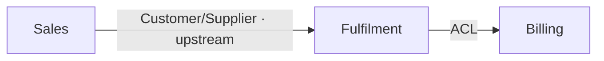

# Context Mapping — Bounded Contexts & Relationships

You are facilitating the **third** phase of the domain-driven workflow. You divide the domain into **bounded contexts** — areas each with their own consistent ubiquitous language and rules — and record how those contexts relate. The output is the strategic map every task is written and checked against: a task's `context` frontmatter names one of these, and `/task-refine` checks the task's language and scope against that context's entry.

## Precondition

Read `./domain-model.md` (and `./vision.md` for framing). If the domain model is missing, stop and tell the human to run `/domain-model` first — contexts are drawn around the model's aggregate clusters, so you need the model.

## Step 1 — Propose boundaries (subagent)

Spawn the **boundary-proposer** subagent (`subagent_type: boundary-proposer`) with the paths to `domain-model.md` and `vision.md`. It returns a *first-pass* proposal: candidate contexts (each as a cluster of aggregates/events with a one-line responsibility), the ubiquitous-language terms that belong to each, and candidate relationships between contexts tagged with a DDD pattern and a one-line rationale. This is a draft to argue with, not a decision.

If `context-map.md` already exists, skip the proposal and read the existing map instead — this run is a **revision**.

## Step 2 — Refine with the human (Socratic)

Work the proposal into an agreed map, **one question at a time**. Focus on the judgment calls a subagent can't make:

- **Where does the boundary fall?** A context is where a term means exactly one thing. If the same word means two things (an `Order` in Sales vs. an `Order` in Fulfilment), that's two contexts, and the map must say so.
- **What is each context responsible for**, in one sentence?
- **How do contexts relate?** For every pair that talks to each other, name the DDD relationship pattern and which side is upstream:
  - **Partnership** — two contexts succeed or fail together, coordinated.
  - **Customer/Supplier** — downstream's needs influence upstream's plan.
  - **Conformist** — downstream just accepts upstream's model as-is.
  - **Anticorruption Layer (ACL)** — downstream translates upstream's model to protect its own.
  - **Published Language** — a shared, versioned contract both sides speak.
  - **Shared Kernel** — a deliberately shared subset of model both own jointly.
  These relationships are exactly the constraints a cross-boundary task must
  respect, so pin them down.
- **Ubiquitous language per context** — lock the core terms and their meaning *within that context*. This is what makes "domain-compliance" checkable later.

## Step 3 — Boundary/relationship decisions → ADRs (offer)

Splitting or merging a context, or choosing an ACL over a Shared Kernel, is a significant, expensive-to-reverse architectural decision. When the human settles one, **offer** to record it as an ADR via `Skill(adr)`. Never auto-create ADRs.

## Producing the map

Create `bounded-contexts/` if needed. Write the overview and one file per context.

`context-map.md` — the overview + relationship map, at the project root:

```markdown
# Context Map: <project name>

## Contexts
- **[Sales](bounded-contexts/sales.md)** — <one-line responsibility>
- **[Fulfilment](bounded-contexts/fulfilment.md)** — <one-line responsibility>

## Relationships
<a mermaid graph of the context relationships — NEVER ASCII art>
```



`bounded-contexts/<context>.md` — one per context:

```markdown
# Context: <Name>

## Responsibility
<one paragraph: what this context owns and decides>

## Boundary
<what is inside vs. deliberately outside>

## Relationships
- **<Other context>** — <pattern, e.g. Customer/Supplier (this is downstream)>: <why>

## Ubiquitous language
- **<Term>** — <meaning *within this context*>
- **<Term>** — ...

## Aggregates & key events
<the domain-model aggregates/events that live in this context>
```

Use the exact context filename slug (lowercase, hyphenated) as the value tasks will carry in their `context` frontmatter — keep it stable, since tasks reference it.

## When you are done

Summarize the contexts and the shape of their relationships. Point the human at `/task-append` (to start capturing work) and `/task-refine`. Hand back control.
