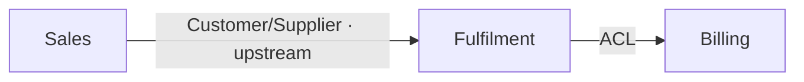

# Context Mapping — Bounded Contexts & Relationships

You are facilitating the **third** phase of the domain-driven workflow. You divide the domain into **bounded contexts** — areas each with their own consistent ubiquitous language and rules — and record how those contexts relate. The output is the strategic map every task is written and checked against: a task's `context` frontmatter names one of these, and `/task-refine` checks the task's language and scope against that context's entry.

## Precondition

Read `./domain-model.md` (and `./vision.md` for framing). If the domain model is missing, stop and tell the human to run `/domain-model` first — contexts are drawn around the model's aggregate clusters, so you need the model.

## Step 1 — Propose boundaries (subagent)

Spawn the **boundary-proposer** subagent (`subagent_type: boundary-proposer`) with the paths to `domain-model.md` and `vision.md`. It returns a *first-pass* proposal: candidate contexts (each as a cluster of aggregates/events with a one-line responsibility), the ubiquitous-language terms that belong to each, and candidate relationships between contexts tagged with a DDD pattern and a one-line rationale. This is a draft to argue with, not a decision.

If `context-map.md` already exists, this run is a **revision** — skip the proposal and follow *Revision mode* below instead. The existing map plus what implementation has taught is a better seed than a fresh proposal.

## Step 2 — Refine with the human (Socratic)

Work the proposal into an agreed map, **one question at a time**. Focus on the judgment calls a subagent can't make:

- **Where does the boundary fall?** A context is where a term means exactly one thing. If the same word means two things (an `Order` in Sales vs. an `Order` in Fulfilment), that's two contexts, and the map must say so.
- **What is each context responsible for**, in one sentence?
- **How do contexts relate?** For every pair that talks to each other, name the DDD relationship pattern and which side is upstream:
  - **Partnership** — two contexts succeed or fail together, coordinated.
  - **Customer/Supplier** — downstream's needs influence upstream's plan.
  - **Conformist** — downstream just accepts upstream's model as-is.
  - **Anticorruption Layer (ACL)** — downstream translates upstream's model to protect its own.
  - **Published Language** — a shared, versioned contract both sides speak.
  - **Shared Kernel** — a deliberately shared subset of model both own jointly.
  These relationships are exactly the constraints a cross-boundary task must
  respect, so pin them down.
- **Ubiquitous language per context** — lock the core terms and their meaning *within that context*. This is what makes "domain-compliance" checkable later.

## Revision mode (when `context-map.md` already exists)

Boundaries drawn before code exist are hypotheses; this mode is where implementation evidence corrects them. Work diff-oriented:

1. **Ask what prompted the revision.** A fresh `/domain-model` revision that reshaped aggregate clusters, a boundary that implementation keeps fighting, a term that turned out to mean two things inside one context — anchor there.
2. **Load the drift worklist.** Run `bash <skills-root>/task-status/tasks.sh deviated`; for each listed id, `tasks.sh get <id>` gives the file path — read **only** that task's `## Closing` section (the `### Deviations from plan` record). This is the workflow's one sanctioned body read: a bounded, id-listed worklist, not a corpus scan. Ask of each deviation: does it implicate a boundary (wrong context, leaked language, a relationship pattern that didn't hold), or is it noise at this level?
3. **Reflect the existing map back, then run the Step 2 flow diff-oriented** — only over the contexts and relationships the evidence or the human implicates. Untouched contexts stand; do not re-litigate settled boundaries without evidence.
4. **Drain the worklist.** When a deviated task's lesson has been folded in (or judged not boundary-level), clear its flag: edit its frontmatter `deviated: true → false`. (`/task-cycle` produces the flag; this revision or a `/domain-model` revision consumes it. If both revisions run, whichever handles a task's lesson clears it.)

### Backlog ripple pass (mandatory after boundary changes)

Context slugs are referenced by live task frontmatter (`context:`, `related_documents:`), so a boundary change can leave tasks pointing at contexts that no longer exist. Before closing a revision that renamed, split, or merged a context, walk the ripple (the session is human-serial, so these writes are safe — this mirrors `/task-refine`'s split-rewire pass):

- **Renamed context** (same boundary, new slug) — mechanical: `bash <skills-root>/task-status/tasks.sh by-context <old-slug>` lists the affected ids; for each **live** task (`draft`/`todo`/`in progress`), edit its `context:` to the new slug and repoint `related_documents:` at the renamed `bounded-contexts/<new-slug>.md`. `done`/`split` tasks are historical records — leave them.
- **Split or merged context** — semantic: which child context a task belongs to is a judgment call, so do **not** guess. List the affected live ids the same way, set nothing, and record each in the session summary as *needs re-homing by `/task-refine`*. If a merged context's slug survives, only the tasks from the absorbed slug need the pass.
- Keep slugs stable whenever the boundary itself didn't change — renames are ripple for zero modeling value.

## Step 3 — Boundary/relationship decisions → ADRs (offer)

Splitting or merging a context, or choosing an ACL over a Shared Kernel, is a significant, expensive-to-reverse architectural decision. When the human settles one, **offer** to record it as an ADR via `Skill(adr)`. Never auto-create ADRs. In a revision, when a new boundary decision reverses one recorded earlier, the new ADR should name and supersede the old one — the log stays honest about the change of course.

## Producing the map

Create `bounded-contexts/` if needed. Write the overview and one file per context.

`context-map.md` — the overview + relationship map, at the project root:

```markdown
# Context Map: <project name>

## Contexts
- **[Sales](bounded-contexts/sales.md)** — <one-line responsibility>
- **[Fulfilment](bounded-contexts/fulfilment.md)** — <one-line responsibility>

## Relationships
<a mermaid graph of the context relationships — NEVER ASCII art>
```



`bounded-contexts/<context>.md` — one per context:

```markdown
# Context: <Name>

## Responsibility
<one paragraph: what this context owns and decides>

## Boundary
<what is inside vs. deliberately outside>

## Relationships
- **<Other context>** — <pattern, e.g. Customer/Supplier (this is downstream)>: <why>

## Ubiquitous language
- **<Term>** — <meaning *within this context*>
- **<Term>** — ...

## Aggregates & key events
<the domain-model aggregates/events that live in this context>
```

Use the exact context filename slug (lowercase, hyphenated) as the value tasks will carry in their `context` frontmatter — keep it stable, since tasks reference it.

## When you are done

Summarize the contexts and the shape of their relationships. Point the human at `/task-append` (to start capturing work) and `/task-refine`. After a **revision**, also report the ripple: which live tasks were mechanically re-slugged, and which are flagged as *needs re-homing by `/task-refine`* — those must be re-homed before `/task-cycle` picks them up. Hand back control.
